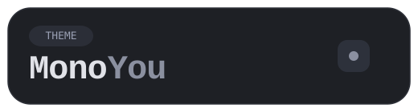
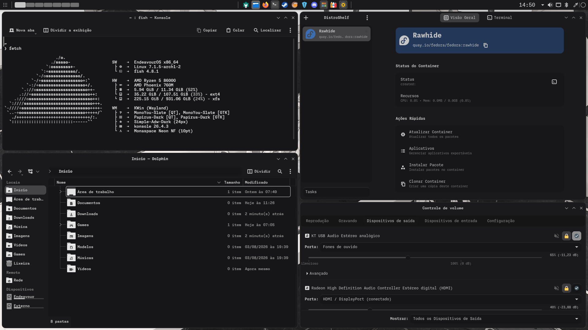

<div align="center">

# MonoYou

*A monochromatic theme inspired by Material You.*




</div>

> [!WARNING]
> **MonoYou is currently a Work in Progress (WIP).**
>
> The project is under active development. Components, colors and implementation details may change before the first stable release.

---

# About

MonoYou is a monochromatic desktop theme inspired by the philosophy of Material You.

Instead of relying on vibrant accent colors, MonoYou focuses on depth, contrast and surface hierarchy using carefully balanced grayscale tones.

Designed for users who prefer a clean, distraction-free workspace.

---

# Preview

| Slate |
|--------|
|  |

---

# Currently Supported

<table>
<tr>
<td valign="top">

### KDE Plasma

| Component | Status |
|----------|:------:|
| Qt 5/6 | ✅ |
| Konsole | ✅ |
| Kvantum | ⏳ |
| Color Scheme | 🚧 |
| Application Style | 🚧 |
| Window Decoration | 🚧 |

</td>

<td width="40"></td>

<td valign="top">

### GNOME

| Component | Status |
|----------|:------:|
| GTK 3 | ✅ |
| GTK 4 | ✅ |
| Libadwaita | ✅ |
| GNOME Shell | ⏳ |

</td>
</tr>
</table>

---

# Roadmap

The features planned for the first complete release of MonoYou.

### Core

- [x] GTK 3
- [x] GTK 4
- [x] Libadwaita
- [x] Qt 5/6
- [x] Plasma Color Scheme
- [ ] Kvantum
- [ ] Plasma Application Style
- [ ] Plasma Window Decoration
- [ ] GNOME Shell

### Terminal

- [x] Konsole
- [ ] Kitty
- [ ] Ghostty

### Variants

- [x] MonoYou Slate
- [ ] MonoYou Ash
- [ ] MonoYou Noir

# Future Goals

Long-term goals for the MonoYou ecosystem.

### Core

- [ ] MonoYou Application Style
- [ ] MonoYou Window Decoration
- [ ] Plasma Theme
- [ ] GNOME Shell Theme

### Assets

- [ ] Icon Theme
- [ ] Cursor Theme
- [ ] Wallpapers

### System

- [ ] SDDM Theme
- [ ] GRUB Theme

### Applications
- [ ] Firefox
- [ ] Discord

---

# Variants

| Variant | Description |
|---------|-------------|
| **Slate** | The reference implementation of MonoYou. |
| **Ash** | A lighter monochromatic variant. *(Planned)* |
| **Noir** | A darker monochromatic variant. *(Planned)* |

---

# Installation

```bash
git clone git@github.com:edwardzerov2/MonoYou.git
```

Copy the desired theme to the appropriate directory for your desktop environment.

Detailed installation instructions will be added soon.

---

# Philosophy

MonoYou is built around a simple idea:

- Minimal.
- Monochromatic.
- Consistent.
- Comfortable.

Every interface element is designed to communicate hierarchy through brightness rather than color.

---

# Acknowledgements

MonoYou is inspired by several projects, communities and design philosophies.

## Design Inspiration

- **Darkly** — the primary inspiration behind MonoYou, influencing its visual identity, Qt Application Style and Plasma theme.
- **Material You** — for its design philosophy centered around surfaces, hierarchy and adaptive interfaces.
- **GrapheneOS** — for inspiring MonoYou's monochromatic aesthetic and minimalist visual direction.
- **Kindle UI** — an indirect inspiration through GrapheneOS, particularly its comfortable grayscale appearance.

## Built Upon

- **Klassy** — for providing the highly customizable window decoration and application style currently used by MonoYou.
- **Breeze** — for establishing the design foundation and consistency of the KDE Plasma desktop.

Thank you to all the developers, designers and contributors behind these amazing projects.

---

# License

Released under the MIT License.
